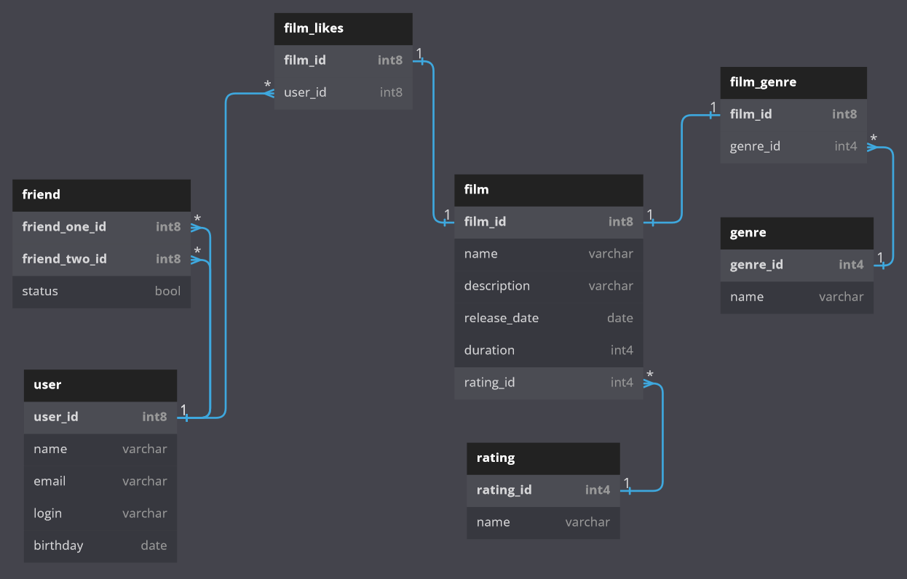

<h1 align="center">ER-диаграмма Filmorate</h1>



## Описание ER-диаграммы

### Что хранится в таблице

**User** - данные о пользователе
- **user_id** - ID пользователя
- **name** - имя
- **email** - почта
- **login** - логин
- **birthday** - дата рождения

**Film** - данные о фильме
- **film_id** - ID фильма
- **name** - название фильма
- **description** - описание
- **release_date** - дата выпуска
- **duration** - продолжительность
- **rating_id** - ID рейтинга

**Friend** - список друзей
- **friend_one_id** - ID первого друга
- **friend_two_id** - ID второго друга
- **status** - статус дружбы

**Film_likes** - данные о лайках фильма
- **film_id** - ID фильма
- **user_id** - ID пользователя, который поставил лайк

**Genre** - список жанров
- **genre_id** - ID жанра
- **name** - название жанра

**Film_genre** - данные о жанре фильма
- **film_id** - ID фильма
- **genre_id** - ID жанра

**Rating** - список жанров
- **rating_id** - ID рейтинга
- **name** - название рейтинга

### Примеры SQL запросов

**Получение данных о фильме**
```
SELECT name, 
    description, 
    release_date, 
    duration,
    mpa
FROM film 
WHERE id=1;
```
**Получение данных о пользователе**
```
SELECT name, 
    email, 
    login, 
    birthday 
FROM user
WHERE id=1;
```