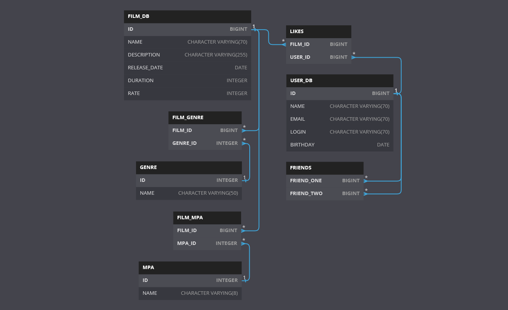

<h1 align="center">ER-диаграмма Filmorate</h1>



## Описание ER-диаграммы

### Что хранится в таблице

**User_DB** - данные о пользователе
- **id** - ID пользователя
- **name** - имя
- **email** - почта
- **login** - логин
- **birthday** - дата рождения

**Film_DB** - данные о фильме
- **id** - ID фильма
- **name** - название фильма
- **description** - описание
- **release_date** - дата выпуска
- **duration** - продолжительность
- **rate** - рейтинг фильма

**Friends** - список друзей
- **friend_one** - ID первого друга
- **friend_two** - ID второго друга

**Likes** - данные о лайках фильма
- **film_id** - ID фильма
- **user_id** - ID пользователя, который поставил лайк

**Genre** - список жанров
- **id** - ID жанра
- **name** - название жанра

**Film_genre** - данные о жанре фильма
- **film_id** - ID фильма
- **genre_id** - ID жанра

**MPA** - список Mpa
- **id** - ID Mpa
- **name** - название Mpa
- 
  **Film_mpa** - данные Mpa фильма
- **film_id** - ID фильма
- **mpa_id** - ID Mpa

### Примеры SQL запросов

**Получение данных о фильме**
```
SELECT
    f.ID,
    f.NAME,
    f.DESCRIPTION,
    f.RELEASE_DATE,
    f.DURATION,
    f.RATE,
    m.ID mpaId,
    m.NAME mpaName,
    g.ID genreId,
    g.NAME genreName,
    (SELECT COUNT(GENRE_ID) FROM FILM_GENRE WHERE f.ID = FILM_ID) genreCounter
FROM FILM_DB f
    LEFT JOIN FILM_GENRE fg ON f.ID = fg.FILM_ID
    LEFT JOIN GENRE g ON fg.GENRE_ID = g.ID
    LEFT JOIN FILM_MPA fm ON fm.FILM_ID = f.ID
    LEFT JOIN MPA m ON fm.MPA_ID = m.ID
WHERE f.ID = ?
```
**Получение данных о пользователе**
```
SELECT
    ID, 
    NAME, 
    EMAIL, 
    LOGIN, 
    BIRTHDAY 
FROM USER_DB
WHERE id= ?
```
**Получение данных о жанре**
```
SELECT 
    ID, 
    NAME 
FROM GENRE 
WHERE ID = ?
```
**Получение данных Mpa**
```
SELECT 
    ID, 
    NAME 
FROM MPA 
WHERE ID = ?
```